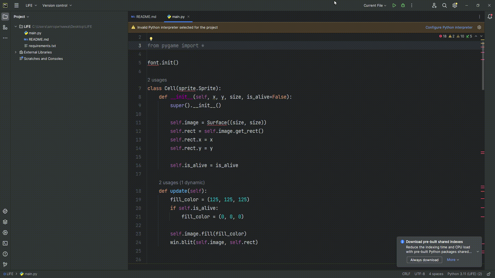

# Game Of Life

## Описание проекта
Проект "Игра Жизни" представляет собой реализацию клеточного автомата, созданного математиком Джоном Конвеем. Игровое поле состоит из клеток, которые могут быть живыми или мертвыми, и их состояние меняется в зависимости от определенных правил взаимодействия с соседними клетками.

Основная цель проекта - исследовать эволюцию клеточной структуры с течением времени, наблюдая за интересными паттернами и стабильными конфигурациями. Программа позволяет визуализировать процесс и анализировать различные начальные условия.


## Настройка окружения
Скачайте проект, в нём будет - main.py и requirements.txt

Дальше чтобы установить библиотеки зайдите в терминал и напишите в нём -
``` shell
pip install -r .\requirements.txt
```


## Управление
`P` - Пауза

`ЛКМ`  - Ставить и убирать клетки


## Пример работы




